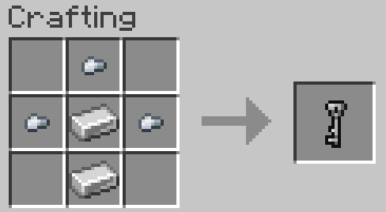
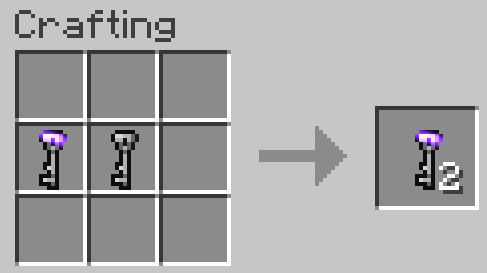

# lockRP
A Minecraft plugin to lock Containers and Openables.

## Description

LockRP is a Minecraft plugin developped for the Universim Roleplay Server.  
It add the possibility to lock/unlock containers and openables by creaing keys.

## Features

### Recipes

#### Key recipe:  
  *(1 stick, 1 iron ingot and 3 iron nuggets)*  
  

#### Key duplicate recipe:  
  *(That recipe is shapeless, you only need a **bound key** and a **blank key**)*  
  

### Actions

- [x] To add a lock to a block: **Hold the key** + **SNEAK** + **RIGHT_CLICK**.
    - A key can lock multiple blocks.
    - A block can only be locked to an unique key but you can make key duplicates.
- [x] To remove a lock:
    - To remove the lock: **Hold the key** + **SNEAK** + **LEFT_CLICK**.
    - To destroy the lock: Break the lock with a pickaxe (iron, gold, diamond, netherrite), this doesn't break the block.
- [x] To interact with a locked bock:
    - Hold the corresponding key while interacting
- [x] To copy a key: Use the key duplicate recipe.

## Contributing
Pull requests are welcome. For major changes, please open an issue first to discuss what you would like to change.

## License
[MIT](https://choosealicense.com/licenses/mit/)
